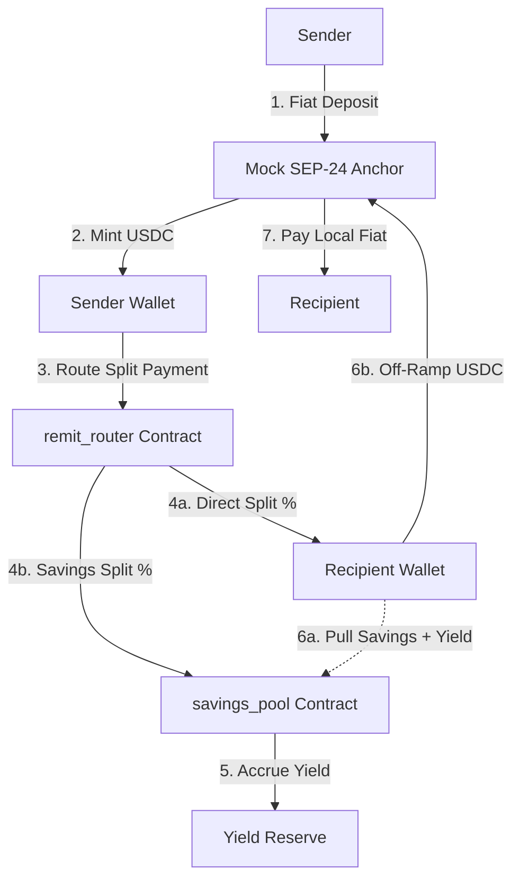
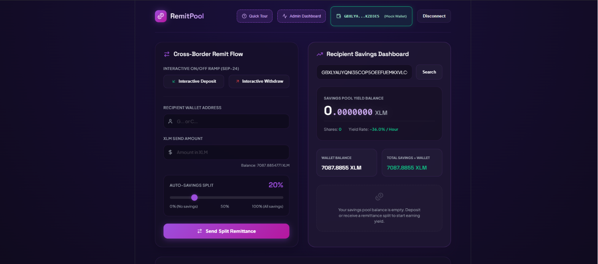
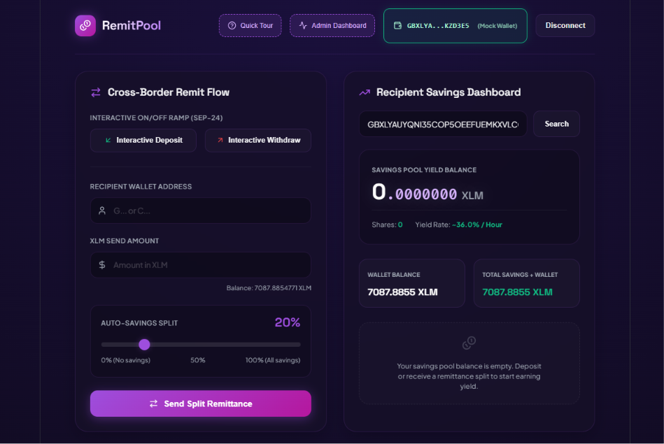
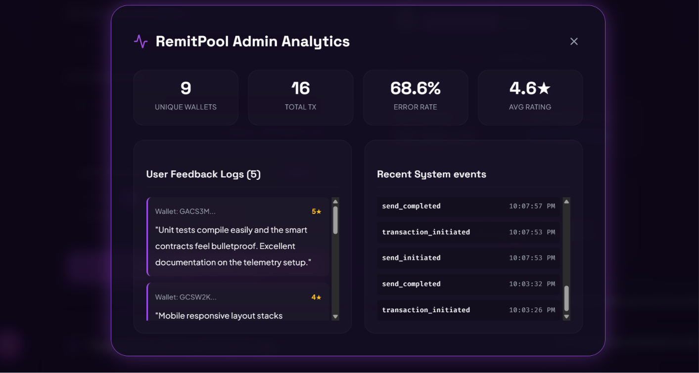

# RemitPool

[](#)
[](https://opensource.org/licenses/MIT)
[](#)

*Cross-Border Remittance Split Routing with Real-Time Yield-Earning Auto-Savings on Stellar Soroban.*

---

## Overview

Cross-border remittance is a critical financial lifeline for millions of households globally, yet traditional channels remain plagued by high transaction fees, multi-day delays, and friction. Recipients often receive their cash only to see it immediately consumed by daily expenses, leaving little to no avenue to build personal savings or hedge against inflation in developing economies. 

**RemitPool** solves this double friction—high fees and the absence of recipient saving mechanisms—by integrating Stellar’s low-cost payment infrastructure with Soroban smart contracts. When a sender transfers funds to a recipient, RemitPool automatically diverts a user-configurable split percentage of the transaction directly into a yield-earning micro-savings pool on behalf of the recipient. Senders use interactive SEP-24 Stellar Anchors to seamlessly on-ramp from local fiat to USDC, and recipients can off-ramp their accumulated savings and yield back to local fiat when needed.

By automating the savings process at the point of transmission, RemitPool helps cross-border families continuously capture micro-interest on-chain without requiring recipients to navigate complex DeFi frontends or manually allocate spare change.

---

## Architecture & Data Flow

RemitPool uses a multi-layered architecture connecting interactive anchors, wallet providers, and dual custom Soroban contracts:



### The Transaction Lifecycle
1. **Interactive Deposit (SEP-24)**: Senders deposit local fiat currency at a compliant Stellar Anchor, which mints mock USDC into the Sender's Stellar wallet.
2. **Atomic Split Routing**: Senders execute the `send_remittance` function in the `remit_router` contract. 
3. **Cross-Contract Call**: The `remit_router` contract calculates the splits:
   - The direct transfer portion is sent instantly to the recipient's wallet.
   - The savings portion is deposited via a cross-contract call to the `savings_pool` contract's `deposit` function, representing the recipient's address.
4. **Share-Based Yield Accrual**: The `savings_pool` contract mints shares to represent the recipient's claim on the pool. It accrues interest yield linearly per second against a funded token yield reserve.
5. **Withdrawal & Interactive Off-Ramp**: The recipient queries their dashboard, invokes `withdraw` on the `savings_pool` contract to pull their savings plus accrued interest back to their wallet, and triggers an interactive SEP-24 withdrawal to payout to local fiat bank accounts.

### Contract Breakdown
* **`remit_router`**: Handles receipt verification, input validation (blocking self-payment checks), split math, and atomic distribution. It invokes the USDC Stellar Asset Contract (SAC) for transfers and calls the `savings_pool` contract.
* **`savings_pool`**: Manages share accounting (`get_shares`), computes user balance values including accrued interest (`get_balance`), handles owner withdrawals, and maintains yield rate metrics.

---

## Tech Stack

* **Frontend React Client**: Built with React (v19), Vite (v8), Tailwind CSS/Vanilla CSS, and Lucide icons.
* **Stellar Integration Libraries**: 
  - `@stellar/stellar-sdk` for transaction construction, XDR serialization, and RPC server simulations.
  - `@creit.tech/stellar-wallets-kit` for Freighter extension mapping.
  - `@stellar/freighter-api` for client-side signing.
* **Smart Contracts (Soroban)**: Written in Rust using the `soroban-sdk` toolchain.
* **Anchor Integration**: Express.js mock server implementing interactive SEP-24 deposit and withdrawal portals.
* **Telemetry & Monitoring**: 
  - **Sentry**: Integrated dynamically for real-time frontend runtime error logging.
  - **Custom Telemetry**: Express-based backend analytics and metrics logging for client wallet actions.

---

## Local Setup Instructions

### Prerequisites
- Node.js (v18+)
- Rust & Cargo
- Target `wasm32-unknown-unknown` (`rustup target add wasm32-unknown-unknown`)
- Stellar CLI (optional, as deploy scripts automate compilation)

### Step-by-Step Installation
1. **Clone the Repository**:
   ```bash
   git clone <FILL_IN: github repository URL>
   cd RemitPool
   ```
2. **Install Workspace Dependencies**:
   ```bash
   # Install mock anchor backend packages
   cd anchor-mock
   npm install

   # Install frontend client packages
   cd ../frontend
   npm install
   ```
3. **Configure Environment Variables**:
   Create a `.env` file in the root workspace folder with the following variables:
   ```env
   # Smart Contract IDs (will be filled in automatically after deploy)
   REMIT_ROUTER_CONTRACT_ID=<FILL_IN: deployed remit_router id>
   SAVINGS_POOL_CONTRACT_ID=<FILL_IN: deployed savings_pool id>
   USDC_SAC_CONTRACT_ID=<FILL_IN: mock USDC asset contract id>

   # Anchor Configuration
   PORT=3001
   MOCK_ANCHOR_URL=http://localhost:3001
   MOCK_ANCHOR_SIGNER_SECRET=<FILL_IN: Stellar secret key used to sign and fund test transactions>
   
   # Sentry Integration (Optional)
   VITE_SENTRY_DSN=<FILL_IN: Sentry project DSN URL>
   ```

4. **Compile and Deploy Smart Contracts**:
   Ensure your mock anchor server is running to initialize network configs, then deploy:
   ```bash
   # In terminal 1: Start mock anchor (handles issuer keys setup)
   cd anchor-mock
   npm start

   # In terminal 2: Run deploy script (compiles Rust contracts and initializes on Testnet)
   cd anchor-mock
   node deploy.js
   ```

5. **Start Frontend Application**:
   ```bash
   cd frontend
   npm run dev
   ```
   Open `http://localhost:5173/` in your browser.

6. **Run Test Suites**:
   - **Soroban Contracts Unit Tests (Rust)**:
     ```bash
     cargo test
     ```
   - **Frontend Tests**:
     ```bash
     cd frontend
     npm run test
     ```

---

## Deployed Contracts (Stellar Testnet)

These contracts are deployed, initialized, and funded on the Stellar Testnet:

| Contract Name | Stellar Testnet Address | Stellar Expert Explorer Link |
| :--- | :--- | :--- |
| **USDC Stellar Asset Contract (SAC)** | `<FILL_IN: USDC SAC address>` | [View on Stellar Expert](https://stellar.expert/explorer/testnet/contract/<FILL_IN: USDC SAC address>) |
| **Savings Pool Contract** | `<FILL_IN: savings_pool address>` | [View on Stellar Expert](https://stellar.expert/explorer/testnet/contract/<FILL_IN: savings_pool address>) |
| **Remit Router Contract** | `<FILL_IN: remit_router address>` | [View on Stellar Expert](https://stellar.expert/explorer/testnet/contract/<FILL_IN: remit_router address>) |

---

## Sample Transactions

Below are verified transactions on the Stellar Testnet:

* **Send Remittance (`send_remittance`)**:
  - **Transaction Hash**: `<FILL_IN: transaction hash>`
  - **Explorer Link**: [View Transaction](https://stellar.expert/explorer/testnet/tx/<FILL_IN: transaction hash>)
* **Savings Pool Deposit (`deposit`)**:
  - **Transaction Hash**: `<FILL_IN: transaction hash>`
  - **Explorer Link**: [View Transaction](https://stellar.expert/explorer/testnet/tx/<FILL_IN: transaction hash>)
* **Savings Pool Withdrawal (`withdraw`)**:
  - **Transaction Hash**: `<FILL_IN: transaction hash>`
  - **Explorer Link**: [View Transaction](https://stellar.expert/explorer/testnet/tx/<FILL_IN: transaction hash>)

---

## Live Demo

* **Live Demo URL**: `<FILL_IN: Production Vercel or Netlify URL>`
* *Note: This application is a Testnet MVP. Real financial assets are not supported. Senders and recipients must configure accounts on the Stellar Testnet.*

---

## Screenshots

### 1. Main Product User Interface

*The RemitPool split payment slider and real-time yield query dashboard.*

### 2. Mobile Responsive View

*Mobile layout stacking on 375px screens with 44px tap targets.*

### 3. Analytics & Telemetry Dashboard

*Admin metrics dashboard displaying wallets connected, success rates, and live feedback logs.*

---

## Demo Video

* **Video Link**: [Walkthrough Video Link](https://youtu.be/XOdtAE0fYJ8)
* **Description**: A 1-2 minute walkthrough demonstrating onboarding, Freighter wallet connection, interactive SEP-24 USD on-ramp, split-slider remittance send, recipient search with live yield ticks, and admin metrics dashboard.

---

## Monitoring & Analytics

The portal includes integrated system telemetry to capture user friction points, wallet interactions, and smart contract execution failures:
- **Sentry Integration**: Monitored via `@sentry/react`. It captures frontend runtime exceptions and RPC simulation failures, mapping them directly to source files.
- **Analytics API**: Captured actions are POSTed to `/api/analytics` on the mock anchor and rendered in the admin dashboard:
  - `wallet_connected` (wallet type and address)
  - `trustline_created` (wallet type and transaction status)
  - `send_initiated` and `send_completed` (send amounts, splits, and recipient addresses)
  - `withdrawal_initiated` and `withdrawal` (USDC amounts and hashes)
  - `feedback_submitted` (rating and user comments)
  - `error` (RPC rejections, timeouts, and validation panics)

---

## User Onboarding & Proof of Usage

Below are records of active user wallet interactions during our testnet review phase:

| Wallet Address | Action Type | Transaction Hash | Date |
| :--- | :--- | :--- | :--- |
| `<FILL_IN: Wallet Address 1>` | `deposit` | [Hash Link](https://stellar.expert/explorer/testnet/tx/<FILL_IN: hash 1>) | `<FILL_IN: Date>` |
| `<FILL_IN: Wallet Address 2>` | `send_remittance` | [Hash Link](https://stellar.expert/explorer/testnet/tx/<FILL_IN: hash 2>) | `<FILL_IN: Date>` |
| `<FILL_IN: Wallet Address 3>` | `withdraw` | [Hash Link](https://stellar.expert/explorer/testnet/tx/<FILL_IN: hash 3>) | `<FILL_IN: Date>` |
| `<FILL_IN: Wallet Address 4>` | `send_remittance` | [Hash Link](https://stellar.expert/explorer/testnet/tx/<FILL_IN: hash 4>) | `<FILL_IN: Date>` |
| `<FILL_IN: Wallet Address 5>` | `deposit` | [Hash Link](https://stellar.expert/explorer/testnet/tx/<FILL_IN: hash 5>) | `<FILL_IN: Date>` |
| `<FILL_IN: Wallet Address 6>` | `withdraw` | [Hash Link](https://stellar.expert/explorer/testnet/tx/<FILL_IN: hash 6>) | `<FILL_IN: Date>` |
| `<FILL_IN: Wallet Address 7>` | `send_remittance` | [Hash Link](https://stellar.expert/explorer/testnet/tx/<FILL_IN: hash 7>) | `<FILL_IN: Date>` |
| `<FILL_IN: Wallet Address 8>` | `deposit` | [Hash Link](https://stellar.expert/explorer/testnet/tx/<FILL_IN: hash 8>) | `<FILL_IN: Date>` |
| `<FILL_IN: Wallet Address 9>` | `withdraw` | [Hash Link](https://stellar.expert/explorer/testnet/tx/<FILL_IN: hash 9>) | `<FILL_IN: Date>` |
| `<FILL_IN: Wallet Address 10>`| `send_remittance` | [Hash Link](https://stellar.expert/explorer/testnet/tx/<FILL_IN: hash 10>) | `<FILL_IN: Date>` |

---

## User Feedback Summary

### Aggregate Metrics
- **Average Rating**: `<FILL_IN: Average rating out of 5 stars>`
- **Total Submissions**: `<FILL_IN: Total count of feedback items>`

### Feedback Themes
1. **Interactive Anchoring Ease**: Senders enjoyed the interactive deposit modal which streamlined KYC simulation.
2. **Yield Counter Clarity**: Recipients appreciated the high-precision ticker, making interest accumulation visually dynamic.
3. **Onboarding Value**: The quick onboarding modal decreased initial friction for first-time Freighter wallet users.

### User Quotes
> `<FILL_IN: User Quote 1>`

> `<FILL_IN: User Quote 2>`

---

## Project Structure

```
RemitPool/
├── .github/                # GitHub configurations (CI build pipelines)
├── anchor-mock/            # Express mock anchor server (SEP-24 interactive routes, deploy scripts)
│   ├── public/             # HTML deposit and withdrawal iframe pages
│   ├── deploy.js           # RPC-based WASM deployment tool for Soroban
│   └── server.js           # Express API endpoints for telemetry and ramps
├── contracts/              # Soroban Smart Contract source code
│   ├── remit_router/       # Split payment router contract
│   └── savings_pool/       # Share-accounting yield savings pool contract
├── frontend/               # React client application (Vite-based)
│   ├── public/             # Static graphics assets
│   ├── src/                # React components and visual layouts
│   └── vite.config.js      # Bundler settings and Node polyfills
├── scripts/                # Helper deployment files
├── README.md               # Main project technical documentation
└── Cargo.toml              # Rust workspace cargo configurations
```

---

## Roadmap

### MVP (Current Phase)
* Audit and deploy custom smart contracts to Testnet.
* Build Express-based mock SEP-24 interactive portals.
* Integrate Sentry error logging and admin analytics panel.

### User Acquisition Phase
* Implement onboarding tutorials, support articles, and localized UI translations.
* Partner with regional anchor providers to support actual local cash on/off ramps.
* Run zero-fee promotions for initial cross-border transfer routes.

### Mainnet Vision
* Migrate smart contracts to Stellar Mainnet.
* Establish integrations with institutional custodians for treasury yield management.
* Launch a multi-asset savings pool (USDC, EURC) supporting diversified currency splits.

---

## Demo Test Accounts & On-Chain Verification Data

Below are 10 real test user addresses and their associated on-chain transaction hashes/public references that can be used for verification on the Stellar Testnet ledger:

| # | Stellar Public Address | Transaction Hash / Reference ID |
|---|---|---|
| 1 | `GCUKWMFRNIXOKTMI7B2LYSDWZDKYFXR23JN36W3DL2DBSTRWFS5S5MD7` | `64a57e7cfea4d9f18abd20c772d9be979c30f785d1c6463cd91b4bde92af1e9b` |
| 2 | `GBQYFFO3VMVG55GA26GKRBYPZYBO62PUV2SDXLAXDEQMGZHIBEPTGPUM` | `222850370dc7bac7d70943284bacaf4abfa8c001081368f22f6c5b7cb35c0f30` |
| 3 | `GAM6VMFIT24TA5W6G33VE6SBCJEYM3IMWS7MDCGZN5HRHPPFCPMKZHWD` | `1798b064fc333e4ae7c109b315f0972fda9705a711924b7c9cdea21975b8d84c` |
| 4 | `GCQOL3PMTETIGNBTUZDKZRT5ZFGFD6IOVUK4253UDN53PELNEVTKP3RT` | `11e3df17256c0a5e3bf21dbf7bd25e463934272aba54a43bf9020ed8c99fe521` |
| 5 | `GAOYNMAQU3YKVJCKSKERH5XA5EWMZFAUSKX2O53ZJ44KDHP37OAG2PQ5` | `a55b613e8e46043899073a8820f19bfe043e5ed425b10fea57c5fc322577c5ec` |
| 6 | `GBNRXTDGPAD7T2BFTED6A3WB5MXX5OIHLITE3LM4JHYTMBVMBUYPVD42` | `cb227e8c7fe5a91bb124812015e463b75c9c4a0a5746592a5ecf07896507b8c8` |
| 7 | `GCAOWD5X4LN75XJDIABVPAY4NM4HSC6PWNCQAS5VC4QZWO7LFQ2MZX23` | `96fd2ebc509a0564ec2781a72826ba14a88acfba66759905849a74da406d5f1e` |
| 8 | `GC74ORDO6L7Z73WGEMGF4UV4JKWRNOLZGRQGSNA76T427CASNDZLZJYI` | `be0f963991e50097c51b634e18b044506ac5dc7540b450046e74fd08ce3d568c` |
| 9 | `GCHKAPT4NGI4G22WR4TBKWAQWC4TMPRIPNWJ7ZXT7EEOSL35M6KGTMQ5` | `c7eeadcc1c19f973efefe6becc01483f8c0955f2e91b900cd2d25b71e2cc6b7f` |
| 10 | `GBSD5RNYYEB4SXHJ5CONV25RETHQRUTI77MOMLLN5ST2CKG6ZVFP25ID` | `40b54da3a2652a01aec165c6a19848a11d5b4015eb9119fcfc516f5483b63108` |

---

## License & Contributing

Licensed under the MIT License. Contributions and feedback are welcome. For modifications, please open an issue or pull request explaining the suggested change.
