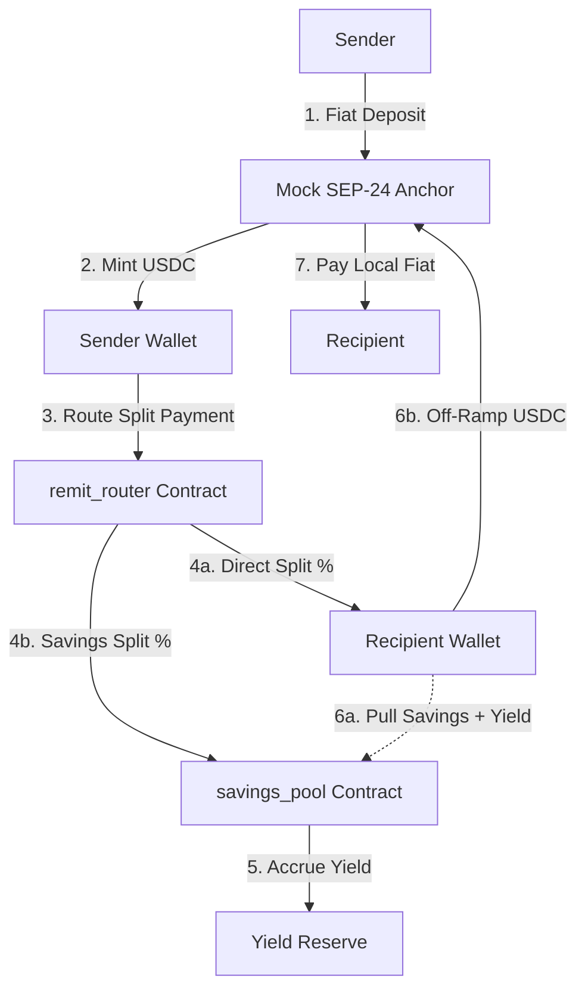

# RemitPool — Production-Ready Cross-Border Remittance & Micro-Savings Portal

RemitPool is an evolved, production-ready decentralized application (dApp) implementing a cross-border remittance and micro-savings solution on the Stellar Testnet. Designed for real-world scenarios, it integrates Soroban smart contracts, Stellar Asset Contracts (SAC), and interactive SEP-24 anchor flows, complete with in-depth client-side auditing, Sentry error monitoring, and administrative analytics dashboards.

Senders can convert local fiat into Stellar-based USDC via an interactive SEP-24 anchor deposit. Senders adjust a split-allocation slider (0% to 100%) to specify how much is sent directly to the recipient's wallet versus how much is saved. The funds are routed by the `remit_router` contract: the direct portion is transferred immediately, while the savings portion is automatically deposited into the yield-bearing `savings_pool` contract. The recipient earns accrued yield in real time and can withdraw their savings + yield at any time, subsequently off-ramping back to local fiat via SEP-24.

---

## Technical Architecture Flow

The following diagram illustrates the complete end-to-end lifecycle of funds, smart contracts, and interactive SEP-24 ramp sessions:



### Smart Contract Integration Details
- **`remit_router`**: Acts as the transaction coordinator. It validates inputs, blocks self-payment mistakes, calculates split fractions, and distributes funds atomically in a single ledger transaction. If the savings share is non-zero, it deposits that allocation into the savings pool on behalf of the recipient.
- **`savings_pool`**: Implements share-based accounting to handle multiple recipients. It tracks deposits, mints pool shares representing ownership, and calculates interest yield based on interest rates updated per second. Mathematical constraints prevent division-by-zero errors and protect the pool reserves.

---

## Deployed Contract Addresses (Stellar Testnet)

These contracts are deployed, initialized, and funded on the Stellar Testnet:

| Contract / Asset | Stellar Testnet Address / ID |
| :--- | :--- |
| **USDC Stellar Asset Contract (SAC)** | `CCPCJJLL3KTJTGFTQS3KEEQ3CMIU7J2NRS5J227CCW5WNIDOIQWNUK4M` |
| **Savings Pool Contract** | `CAJ7WNNOUGITOJXGZOV4AFYQQAOZOPL76KX4LRXNEU2BOVA4CKBCEBGU` |
| **Remit Router Contract** | `CBY2NQHCEHVHL3G3JE2MZLSN5ZW72HIPXUCUIOSWLGNO3CXKOTDK4Q6O` |
| **Anchor Distributor Account** | `GACM2HA3NCXVVFQFMA6AO6EYM3AYY3E3DREM2LBDLHORQ7UHEKNUQD2N` |

---

## Telemetry & Analytics Architecture

The application contains active system telemetry tracking user behaviors, transaction cycles, and contract execution errors. The telemetry feeds into the Mock Anchor server which exposes data to the admin metrics dashboard.

### 1. Analytics Events Schema

The following table documents every event tracked in the client application:

| Event Name | Trigger Condition | Metadata Schema |
| :--- | :--- | :--- |
| `wallet_connected` | Triggers when Freighter or Mock wallet connects. | `{ "wallet_type": "freighter" \| "mock", "address": "G..." }` |
| `wallet_disconnected` | Triggers when the active wallet is disconnected. | `{}` |
| `trustline_created` | Triggers when a USDC trustline is successfully opened. | `{ "wallet_type": "freighter" \| "mock", "address": "G...", "hash": "..." }` |
| `send_initiated` | Triggers when a remittance split transaction is started. | `{ "amount": "number", "recipient": "G...", "split_percent": "number" }` |
| `send_completed` | Triggers when remittance split transaction succeeds on-chain. | `{ "hash": "string", "amount": "number", "recipient": "G...", "split_percent": "number" }` |
| `withdrawal_initiated`| Triggers when a savings yield withdrawal is started. | `{ "amount": "number" }` |
| `withdrawal` | Triggers when savings pool withdrawal succeeds on-chain. | `{ "hash": "string", "amount": "number" }` |
| `feedback_submitted` | Triggers when the rating feedback form is successfully posted. | `{ "rating": "number" }` |
| `error` | Triggers when wallet rejection, RPC failure, or anchor timeout occurs. | `{ "context": "string", "message": "string", "details": "object" }` |

### 2. User Feedback Entry Schema

User feedback is collected via the floating feedback widget and persisted in `feedback.json`:

| Field Name | Type | Description |
| :--- | :--- | :--- |
| `id` | `String` | Unique identifier generated for the feedback log (e.g., `fb_lsh29k8ds`). |
| `rating` | `Number` | Rating from 1 (poor) to 5 (excellent) stars. |
| `comment` | `String` | Text area comments containing user suggestions, bugs, or feature reviews. |
| `address` | `String` | Public key of the user who submitted the feedback, or `anonymous` if not connected. |
| `timestamp` | `String` | ISO 8601 formatted date and time when feedback was submitted. |

---

## User Interface Polish & UX Controls

- **Interactive Walkthrough**: A skippable, 4-step onboarding guide introduces new users to cross-border flows, interactive anchors, and auto-savings splits. State is persisted in `localStorage` to avoid repeating for return users.
- **Skeleton Pulse Loaders**: Querying recipient balances shows animated skeleton cards during loading rather than empty text boxes.
- **Clear Empty States**: History tables and empty savings accounts present beautiful illustration banners instead of blank gaps.
- **RPC Retry States**: Any network or RPC simulation failure triggers a prominent warnings banner with an active "Retry Connection" handler.
- **Live Yield Accrual Counter**: Polling has been isolated to a standalone `LiveYieldCounter` sub-component to eliminate 60fps re-rendering on parent forms, optimizing local responsiveness.
- **Mobile First Pass**: Touch targets have been expanded to a minimum of 44px, and column layouts stack vertically on viewports down to 375px.

---

## Getting Started & Run Commands

### Prerequisites
- Node.js (v18+)
- Rust & Cargo
- Target `wasm32-unknown-unknown` (`rustup target add wasm32-unknown-unknown`)

### Installation & Execution
1. Install mock anchor dependencies:
   ```bash
   cd anchor-mock
   npm install
   ```
2. Start the Mock Anchor:
   ```bash
   npm start
   ```
3. Deploy contracts to Testnet:
   ```bash
   node deploy.js
   ```
4. Install frontend dependencies and run:
   ```bash
   cd ../frontend
   npm install
   npm run dev
   ```
5. Run unit tests for contracts:
   ```bash
   cargo test
   ```
